# Ralph Skill

Autonomous work item orchestrator — turns the VS Code agent into a hands-off executor by driving [Open Ralph Wiggum](https://github.com/Th0rgal/open-ralph-wiggum) with GitHub Copilot CLI.

## Quick Start

```
"Run WI-001, WI-002, WI-003 with ralph"
```

The orchestrator will parse the work items, validate prerequisites, ask you a few setup questions (including retry budget), then execute each one autonomously via Ralph's agentic loop.

## Architecture Overview

When multiple work items are assigned, three tiers of context isolation come into play. The **VS Code agent** orchestrates, **subagents** run the ralph CLI, and **Copilot CLI** iterates within each ralph loop. State flows between iterations and work items exclusively through the **filesystem** — not memory.

### Control Flow Diagram

```mermaid
flowchart TB
    User["👤 User\n'Run WI-001, WI-002, WI-003 with ralph'"]

    subgraph CTX_ORCH["CONTEXT WINDOW 1 — VS Code Agent (Orchestrator)\nPersistent across all work items · Has workspace access + skill instructions"]
        direction TB

        Parse["📖 Step 1: Parse all work items\nRead WI_001.md, WI_002.md, WI_003.md"]
        Topo["🔀 Topological Sort\nWI-001 → WI-002 (depends 001) → WI-003 (depends 002)"]

        subgraph VAL["Step 2: Validate + Ask Retry Budget"]
            V1["Check dependency statuses"]
            V2["Flag ambiguities / conflicts"]
            V3["ask_questions:\n• resolve blockers\n• set maxRetriesPerWI (default: 2)"]
        end

        Setup["🔧 Step 3: Setup Ralph\nbash scripts/setup-ralph.sh"]

        subgraph LOOP["Sequential Execution Loop (retry-aware)"]
            direction TB

            subgraph WI1["────── WI-001 (retriesUsed: 0/max) ──────"]
                Gen1["📝 Step 4: Generate prompt\n.tmp/ralph/prompts/WI-001-prompt.md"]
                Exec1["🚀 Step 5: Launch subagent"]
                Verify1["✅ Step 6: Verify\nBuild · Tests · Artifacts"]
                Gate1{"Pass?"}
                Retry1{"retriesUsed\n< max?"}
            end

            subgraph WI2["────── WI-002 (retriesUsed: 0/max) ──────"]
                Gen2["📝 Generate prompt"]
                Exec2["🚀 Launch subagent"]
                Verify2["✅ Verify"]
                Gate2{"Pass?"}
                Retry2{"retriesUsed\n< max?"}
            end

            subgraph WI3["────── WI-003 (retriesUsed: 0/max) ──────"]
                Gen3["📝 Generate prompt"]
                Exec3["🚀 Launch subagent"]
                Verify3["✅ Verify"]
                Gate3{"Pass?"}
                Retry3{"retriesUsed\n< max?"}
            end
        end

        Report["📋 Final Report to User\nPer-WI status + attempt counts"]
    end

    subgraph CTX_SUB1["CONTEXT WINDOW 2 — Subagent (WI-001)\nIsolated · Sees only its terminal + instructions"]
        Ralph1["🔁 ralph --agent copilot\n--prompt-template frontend-builder.md\n--prompt-file WI-001-prompt.md\n--model claude-sonnet-4.6 --no-commit\n--max-iterations 20 --verbose-tools\n--allow-all --no-stream\n--completion-promise COMPLETE --abort-promise ABORT"]
    end

    subgraph CTX_COPILOT1["CONTEXT WINDOW 3 — Copilot CLI (per iteration)\nFresh each iteration · Sees prompt + changed files + git history"]
        Iter1_1["Iteration 1: Read prompt → edit files"]
        Iter1_2["Iteration 2: See prev changes → run build → fix"]
        Iter1_N["Iteration N: All tests pass → COMPLETE"]
    end

    subgraph CTX_SUB2["CONTEXT WINDOW 4 — Subagent (WI-002)\nIsolated · Sees only its terminal + instructions"]
        Ralph2["🔁 ralph --agent copilot\n--prompt-template backend-builder.md\n--prompt-file WI-002-prompt.md\n--model claude-sonnet-4.6 --no-commit\n--max-iterations 20 --verbose-tools\n--allow-all --no-stream\n--completion-promise COMPLETE --abort-promise ABORT"]
    end

    subgraph CTX_COPILOT2["CONTEXT WINDOW 5 — Copilot CLI (per iteration)\nFresh each iteration · Sees prompt + codebase incl. WI-001 changes"]
        Iter2_1["Iteration 1: Read prompt → implement"]
        Iter2_N["Iteration N: All tests pass → COMPLETE"]
    end

    subgraph CTX_SUB3["CONTEXT WINDOW 6 — Subagent (WI-003)\nIsolated · Sees only its terminal + instructions"]
        Ralph3["🔁 ralph --agent copilot\n--prompt-template frontend-builder.md\n--prompt-file WI-003-prompt.md\n--model claude-opus-4.6 --no-commit\n--max-iterations 30 --verbose-tools\n--allow-all --no-stream\n--completion-promise COMPLETE --abort-promise ABORT"]
    end

    subgraph CTX_COPILOT3["CONTEXT WINDOW 7 — Copilot CLI (per iteration)\nFresh each iteration · Sees prompt + codebase incl. WI-001+WI-002 changes"]
        Iter3_1["Iteration 1: Read prompt → implement"]
        Iter3_N["Iteration N: All tests pass → COMPLETE"]
    end

    User --> Parse
    Parse --> Topo
    Topo --> VAL
    V1 --> V2 --> V3
    VAL --> Setup
    Setup --> Gen1

    Gen1 --> Exec1
    Exec1 -.->|"runSubagent()"| Ralph1
    Ralph1 -.->|"spawns copilot"| Iter1_1
    Iter1_1 --> Iter1_2 --> Iter1_N
    Iter1_N -.->|"returns"| Ralph1
    Ralph1 -.->|"result"| Verify1
    Verify1 --> Gate1
    Gate1 -->|"✅ Pass"| Gen2
    Gate1 -->|"❌ Fail"| Retry1
    Retry1 -->|"Yes → ++retriesUsed,\nadd-context"| Exec1
    Retry1 -->|"No → ask user:\nskip / abort / increase"| Report

    Gen2 --> Exec2
    Exec2 -.->|"runSubagent()"| Ralph2
    Ralph2 -.->|"spawns copilot"| Iter2_1
    Iter2_1 --> Iter2_N
    Iter2_N -.->|"returns"| Ralph2
    Ralph2 -.->|"result"| Verify2
    Verify2 --> Gate2
    Gate2 -->|"✅ Pass"| Gen3
    Gate2 -->|"❌ Fail"| Retry2
    Retry2 -->|"Yes"| Exec2
    Retry2 -->|"No"| Report

    Gen3 --> Exec3
    Exec3 -.->|"runSubagent()"| Ralph3
    Ralph3 -.->|"spawns copilot"| Iter3_1
    Iter3_1 --> Iter3_N
    Iter3_N -.->|"returns"| Ralph3
    Ralph3 -.->|"result"| Verify3
    Verify3 --> Gate3
    Gate3 -->|"✅ Pass"| Report
    Gate3 -->|"❌ Fail"| Retry3
    Retry3 -->|"Yes"| Exec3
    Retry3 -->|"No"| Report

    Report --> User
```



### Context Window Boundaries

| Boundary | What It Sees | Lifetime | Memory Model |
|----------|-------------|----------|--------------|
| **CW 1 — VS Code Orchestrator** | Full workspace, skill instructions, work item markdown, `ask_questions` for human interaction | Persists across **all** work items — tracks retry counts, remembers which WIs passed | Agent memory (in-session) |
| **CW 2/4/6 — Subagents** | Only the terminal command + instructions provided by orchestrator | One per work item attempt — dies after ralph exits | None (stateless) |
| **CW 3/5/7 — Copilot CLI** | Same prompt text every iteration + whatever it reads from the **filesystem** (accumulated changes + git history) | **Fresh each iteration** — no memory of prior iterations | Filesystem only |

### How State Flows

```
Between Copilot iterations (within one Ralph loop):
  Iteration 1 writes files → Iteration 2 reads those files from disk
  (Ralph re-sends the same prompt; Copilot discovers prior work via file contents & git diff)

Between work items (across Ralph loops):
  WI-001 commits changes → WI-002's Copilot reads the updated codebase
  (Orchestrator gates WI-002 on WI-001 verification; filesystem is the state bridge)

Between retries (same work item):
  Attempt 1 leaves partial work → Attempt 2 sees it + receives --add-context with failure details
  (Orchestrator injects specific error info so Ralph can self-correct)
```

### Retry Budget Enforcement

The orchestrator asks the user **once** at the start for `maxRetriesPerWI` (default: 2). This means each work item gets **up to 3 total attempts** (1 initial + 2 retries). The budget is a hard ceiling — the orchestrator never silently exceeds it.

```
WI-001: Attempt 1 → ❌ fail → Attempt 2 → ❌ fail → Attempt 3 → ✅ pass → proceed to WI-002
WI-002: Attempt 1 → ✅ pass → proceed to WI-003
WI-003: Attempt 1 → ❌ fail → Attempt 2 → ❌ fail → Attempt 3 → ❌ fail → BUDGET EXHAUSTED
         → Ask user: skip WI-003 / abort / increase budget
```

## File Structure

```
ralph-skill/
├── SKILL.md                        # Orchestration instructions (agent reads this)
├── README.md                       # This file — architecture docs for humans
├── scripts/
│   ├── run-ralph.sh                # Run Ralph with all mandatory flags
│   ├── setup-ralph.sh              # Downloads Ralph from github
│   └── watch-ralph.sh              # Tail Ralph log output
├── tests/
│   └── test-streaming.sh           # Streaming smoke test
└── references/
    └── prompt-engineering.md        # Prompt generation guide + template
```

## Prerequisites

- [Bun](https://bun.sh/) runtime (for Ralph)
- GitHub Copilot CLI on PATH (`copilot` binary or `gh copilot` extension)
- Work items with concrete acceptance criteria in `workitems/items/`

## Monitoring & Streaming

- The skill supports an **opt-in streaming mode**: when enabled the subagent invocation will stream Ralph's stdout/stderr to `.tmp/ralph/logs/WI-{ID}.log` so you can follow progress from another terminal.
- Use the helper scripts in `scripts/`:
  - `run-ralph.sh <WI-ID> --prompt-template <path> [--model <model>] [--max-iterations <N>] [--stream]` — run Ralph with all mandatory flags. `--prompt-template` is required. Model is read from `state.json` if `--model` is omitted. Optionally enable streaming into `.tmp/ralph/logs/<WI-ID>.log`.
  - `watch-ralph.sh <WI-ID|log-path>` — tail the corresponding log file (or a direct path) for live monitoring
- Logs live in `.tmp/ralph/logs/`. Keep an eye on retention and avoid writing secrets into prompts.
