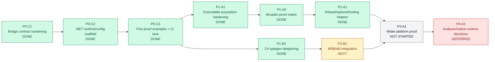

# .NET Initiative Progression

This board is the lightweight visual overlay for the `.NET` initiative.

Authoritative note:
- This file is the portable source of truth for progression-visual prompting behavior in this initiative.
- Do not rely on Copilot memory for this rule; keep the rule here and in `.squad/decisions.md`.

Usage rule:
- When asking Matthew to choose among work progression, prioritization, delegation, creation, or related next-step concerns, reference this board and the relevant node IDs.
- Keep statuses limited to `done`, `in progress`, `next`, `not started`, or `deferred`.
- Prefer updating this board after meaningful work batches rather than tracking every micro-task.

## Current Board

## Node Glossary

- `P0-C1`: Bridge contract hardening in the CLI and machine-readable fixtures.
- `P0-C2`: Startup-only `.NET` runtime and configuration provider scaffold.
- `P0-C3`: Initial runnable examples, proof command, and one CI lane.
- `P1-A1`: Executable acquisition and version-handshake hardening.
- `P1-B1`: C# type generation deepening beyond the initial specimen.
- `P1-A2`: Broader proof matrix expansion after acquisition hardening.
- `P2-A1`: Reload, options, and hosting-helper work.
- `P2-B1`: MSBuild integration for generated C# output.
- `P3-A1`: Wider platform and framework proof coverage.
- `P4-A1`: Deferred analyzer or native-runtime decisions.
